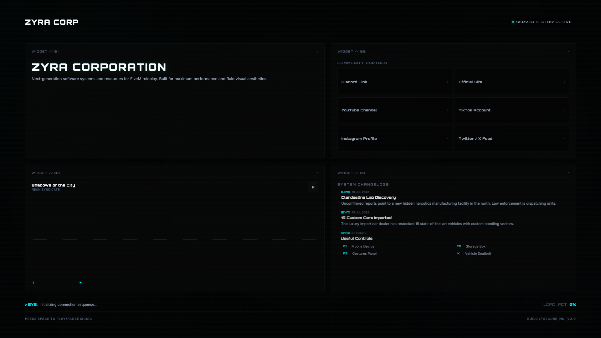
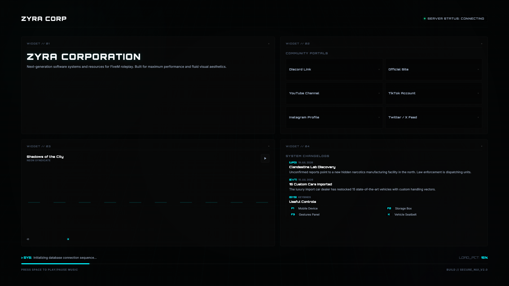

<p align="center">
  
  
  
</p>

# 🖥️ Zyra Loading Screen 5 - Tech Dashboard Edition

Welcome to **Zyra-Loading-Screen-5**, a futuristic FiveM loading screen resource by **Zyra Store**. Designed as a high-tech Cyber HUD Dashboard with Orbitron typography and system diagnostic widgets.

---

## 📸 Preview Showcase





---

## 🛠️ Key Features

- **Sci-Fi Tech Dashboard UI:** Cybernetic HUD layout filled with system diagnostic widgets and telemetry metrics.
- **Orbitron & Inter Fonts:** Futuristic sci-fi headings with clean technical body text.
- **Live System Changelog Widget:** Real-time display for patch notes, server version updates, and dev notes.
- **Cyber Audio Controller:** Futuristic music player interface with track progress and audio toggles.
- **Real-Time Data Progress:** Terminal-inspired loading bar tracking FiveM client file downloads.

---

## 📦 Installation Instructions

1. **Copy the Resource:**
   Place `Zyra-Loading-Screen-5` in your server's `resources` directory:
   `resources/[zyra]/Zyra-Loading-Screen-5`

2. **Configure `server.cfg`:**
   Add to your `server.cfg`:
   ```cfg
   ensure Zyra-Loading-Screen-5
   ```

3. **Restart Server:**
   Save changes and restart FiveM server or run:
   ```cmd
   refresh
   ensure Zyra-Loading-Screen-5
   ```

---

## ⚙️ Configuration Guide (`config.js`)

- **Widget Branding:** Set server title, widget identifiers, and claim statement.
- **Changelog Data:** Customize version numbers, patch notes, and release logs.
- **Music Playlist:** Insert direct `.mp3` track URLs and set initial volume.

---

## ⛔ License & Commercial Restrictions

> [!CAUTION]
> **RESALE IS STRICTLY PROHIBITED (OPEN CODE RESOURCE)**
> This resource is released as **Open Code / Open Source**. Selling, re-selling, monetizing, or offering this resource on Tebex, Discord, or any commercial platform is **STRICTLY PROHIBITED**. You are permitted to modify and use this code freely on your personal FiveM servers, but commercial distribution is prohibited by **Zyra Store**.

---

## 💎 Credits & Support

Developed with ❤️ by **Zyra Store**.  
All rights reserved.
